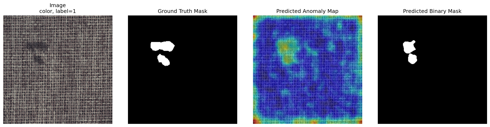
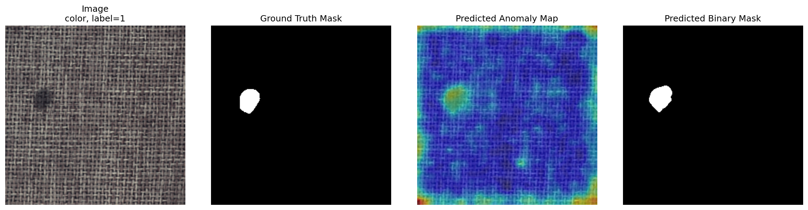
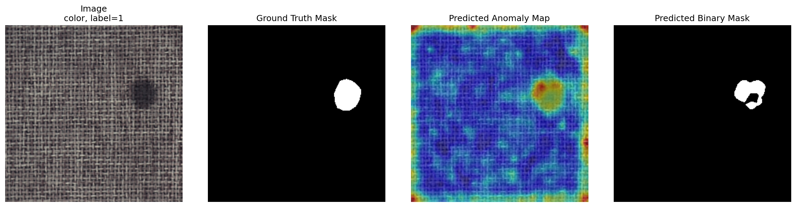
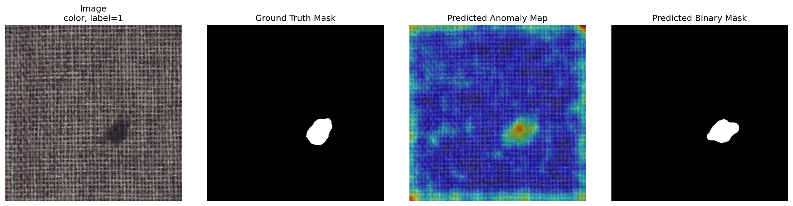

# 🧵 Anomaly Detection in Textured Industrial Surfaces
### MVTec AD – Carpet Category

  [](DATASET_LICENSE.md)

---

## 📋 Overview

This repository contains a solution for **anomaly detection and localization** on textured industrial surfaces using the [MVTec Anomaly Detection dataset](https://www.mvtec.com/company/research/datasets/mvtec-ad), specifically the **carpet** category.

### Goals
1. Determine whether a test image contains a defect
2. Localize the anomalous region if a defect is present

The dataset provides only **defect-free training images**, making this a **one-class / unsupervised anomaly detection** problem. The system must learn what *normal carpet texture* looks like and flag deviations at test time.

### What's Included
- Dataset inspection utilities
- Reconstruction-based baseline (autoencoder)
- Feature-based final method (nearest-neighbor memory bank)
- Quantitative evaluation
- Qualitative visualizations
- Reproducible scripts

---

## 🧠 Problem Interpretation

### What the Task Really Is

This is **not** a standard supervised classification problem. The training set contains **only normal images**, which fundamentally changes the approach:

- Learn the distribution of normal carpet texture from defect-free training images
- Detect whether a test image deviates from learned normality
- Produce a spatial anomaly map highlighting where the deviation occurs

### What Counts as an Anomaly

> An anomaly is any local deviation from the repeating normal carpet texture that is not well explained by the normal training distribution.

No hard-coded rules for specific defect categories (color, cut, hole, thread, metal contamination). The methods learn *normal texture consistency* and detect departures from it.

### Why This Is Challenging

The carpet category is a **textured surface dataset**, which introduces:
- Defects can be small and localized
- Normal texture is repetitive and high-frequency
- Some anomalies differ more by local structure or texture statistics than by large semantic content
- Image-level classification can be harder than pixel-level localization

---

## 📂 Dataset

### Structure
```text
data/carpet/
├── train/
│   └── good/
├── test/
│   ├── color/
│   ├── cut/
│   ├── good/
│   ├── hole/
│   ├── metal_contamination/
│   └── thread/
└── ground_truth/
    ├── color/
    ├── cut/
    ├── hole/
    ├── metal_contamination/
    └── thread/
```

### Summary

| Split | Count |
|---|---|
| Training (good) images | 280 |
| Test images (total) | 117 |
| Normal test images | 28 |
| Defective test images | 89 |

| Defect Type | Count |
|---|---|
| color | 19 |
| cut | 17 |
| hole | 17 |
| metal_contamination | 17 |
| thread | 19 |
| good (normal) | 28 |

### Image Properties

| Property | Value |
|---|---|
| Original resolution | 1024 × 1024 |
| Color mode | RGB |
| Resized to | 256 × 256 |

**Labels:**
- `label = 0` → normal / good
- `label = 1` → defective (with pixel-level ground truth mask)

---

## 📁 Repository Structure

```text
mvtec-carpet-anomaly/
├── data/
├── checkpoints/
├── results/
│   └── visualizations/
├── src/
│   ├── inspect_dataset.py       # Verify folder structure and image properties
│   ├── dataset.py               # PyTorch dataset class
│   ├── test_dataset.py
│   ├── model.py                 # Convolutional autoencoder baseline
│   ├── test_model.py
│   ├── train.py                 # Train autoencoder
│   ├── infer.py                 # Run inference
│   ├── check_scores.py
│   ├── evaluate.py              # Evaluate baseline
│   ├── feature_model.py         # ResNet18 feature extractor
│   ├── build_memory_bank.py     # Build normal-feature memory bank
│   ├── evaluate_features.py     # Quantitative evaluation (final method)
│   └── visualize_features.py    # Qualitative visualization panels
├── README.md
├── requirements.txt
└── .gitignore
```

---

## ⚙️ Methodology

Two methods were implemented in progression — starting with a simple baseline, evaluating it honestly, then improving based on observed weaknesses.

---

## 🔧 Method 1 — Reconstruction-Based Baseline (Autoencoder)

### Motivation

A convolutional autoencoder is a standard and interpretable baseline for one-class anomaly detection.

**Intuition:**
1. Train only on normal images
2. Let the model learn to reconstruct normal carpet texture
3. At test time, compute reconstruction error
4. Higher reconstruction error → anomalous region

### Architecture

- **Encoder:** Stacked convolutional downsampling blocks
- **Decoder:** Stacked transposed convolutions
- **Loss:** Reconstruction loss

### Inference Logic

- Anomaly map = absolute reconstruction error
- Image-level score = aggregation of anomaly map values (max or top-k mean)

### Why It Was Not Enough

For textured surfaces like carpet:
- Raw pixel reconstruction error is too sensitive to harmless local variation
- Not sensitive enough to the right kind of texture irregularities
- Reconstruction methods struggle on fine textures — defects are better characterized in **feature space**

---

## 🚀 Method 2 — Feature-Based Nearest-Neighbor (Final Method)

### Motivation

Use a pretrained CNN to extract local feature representations from normal images, store them in a memory bank, then compare test patches against it.

> Conceptually similar to **PatchCore / feature-memory anomaly detection**, implemented in a simpler, more lightweight way.

### Why This Fits Carpet Textures

Textured industrial surfaces are defined by:
- Local pattern regularity
- Structural repetition
- Texture statistics

Pretrained CNN intermediate features capture these texture patterns far better than raw reconstruction loss.

### Feature Extractor

- **Backbone:** Pretrained ResNet18 (`torchvision`)
- **Layers used:** `layer1` + `layer2`
- Deeper feature map upsampled to shallow map resolution, then concatenated

### Memory Bank Construction

1. Pass all normal training images through the feature extractor
2. Collect local patch features
3. Concatenate into a memory bank
4. Subsample to max **10,000 features** (CPU efficiency)

### Test-Time Anomaly Scoring

1. Extract patch features from test image
2. Compute Euclidean distance to nearest memory-bank feature
3. Form a low-resolution anomaly map
4. Upsample back to image resolution

### Post-Processing for Binary Masks

To improve qualitative localization:
- Gaussian smoothing on anomaly map
- Border suppression (reduce edge artifacts)
- Percentile thresholding → binary mask
- Connected-component filtering (remove spurious regions)
- Hole filling + light dilation

> ⚠️ Post-processing improves **qualitative mask readability** and does not artificially inflate anomaly-map evaluation metrics.

---

## 🔑 Key Design Decisions

| Decision | Rationale |
|---|---|
| Start with baseline | Provides a meaningful comparison point |
| Resize to 256×256 | CPU-practical; preserves enough spatial info for localization |
| Pretrained ResNet features | Robust, generic local visual descriptors; strong for texture transfer |
| Use `layer1` + `layer2` | Balances low-level spatial detail with discriminative texture representation |
| Subsample memory bank | CPU efficiency trade-off |
| Separate anomaly map from binary mask | Pixel ROC-AUC on continuous scores; binary masks are visualization aids |

---

## 📊 Results

### Quantitative Results

| Method | Image ROC-AUC | Pixel ROC-AUC |
|---|---|---|
| Autoencoder baseline | 0.3720 | 0.5617 |
| Improved autoencoder | 0.3888 | 0.5688 |
| **Feature-based memory bank** | **0.5766** | **0.9198** |

### Interpretation

**Autoencoder baseline:** Both metrics were weak — reconstruction error is not a strong signal for textured surfaces.

**Improved autoencoder:** Minor gains from normalization, longer training, and smoothing. Core limitation was methodological.

**Feature-based method:** Substantial improvement, especially at pixel level.

> 🏆 **Key result: Pixel ROC-AUC = 0.9198**
>
> The continuous anomaly map is highly informative for localization. The method is much stronger at *where* the defect is than at producing a reliable global yes/no score.

---

## 🖼️ Qualitative Results

Visualization panels are saved to `results/visualizations/` and show:

| Column | Description |
|---|---|
| Input image | Original test image |
| Ground truth mask | Pixel-level defect annotation |
| Predicted anomaly map | Continuous heatmap from the feature method |
| Predicted binary mask | Thresholded and post-processed output |

**What to look for:**
- Anomaly map responds strongly at the true defect location ✅
- Binary masks are generally aligned with the defective region ✅
- Post-processing substantially reduces border artifacts ✅
- Some masks may be slightly coarse, fragmented, or incomplete ⚠️

<!-- Replace the filenames below with your actual saved visualization files -->
**Example 1**


**Example 2**


**Example 3**


**Example 4**


---

## 🔍 Observations & Analysis

### Reconstruction Error Was Not a Good Enough Signal
The autoencoder reduced training loss but did not translate into strong anomaly discrimination — confirming that low-level reconstruction is often insufficient for textured anomaly detection.

### Image-Level Score Aggregation Matters
Max anomaly-map value was unstable; isolated high-error pixels can occur in normal images too. Top-k averaging helped but didn't fix the root cause (weak autoencoder maps).

### Feature Space >> Pixel Space
The final method worked because it compared local representations **in feature space** instead of raw pixel differences — much better at capturing normal texture regularity.

### Localization >> Binary Classification
The strongest result is localization, not image-level classification. Visible both quantitatively and qualitatively.

### Border Artifacts Are a Recurring Practical Issue
Distance-based feature maps show elevated response near image boundaries. Border suppression and connected-component filtering noticeably improved mask quality.

---

## ⚠️ Limitations

| Limitation | Detail |
|---|---|
| Modest image-level performance | Image ROC-AUC remains only moderate; more reliable for localization than yes/no detection |
| Heuristic thresholding | Binary masks rely on percentile thresholds, not learned or validated splits |
| Limited feature-map resolution | Upsampled CNN maps can produce coarse boundaries |
| Random memory bank subsampling | May discard useful normal patch diversity |
| No dedicated validation split | Thresholds not tuned on a held-out validation set |

---

## 🔮 What I Would Improve With More Time

- **Stronger memory-based method** — Implement [PatchCore](https://arxiv.org/abs/2106.08265) or [PaDiM](https://arxiv.org/abs/2011.08785)
- **Multi-scale feature aggregation** — More carefully calibrated fusion across layers
- **Better image-level scoring** — Top-k pooling, score normalization, region-aware aggregation
- **Faster nearest-neighbor search** — Replace `torch.cdist` with [FAISS](https://github.com/facebookresearch/faiss) or approximate search
- **Validation-driven threshold calibration** — Calibrate segmentation and decision thresholds on a small validation split
- **Higher image resolution** — Better small-defect boundary quality

---

## 🎯 Final Method Summary

| | |
|---|---|
| **Method** | Feature-based nearest-neighbor anomaly detection |
| **Backbone** | Pretrained ResNet18 |
| **Features** | `layer1` + `layer2` (intermediate CNN layers) |
| **Matching** | Euclidean distance to nearest normal patch in memory bank |
| **Pixel ROC-AUC** | **0.9198** |
| **Image ROC-AUC** | 0.5766 |

**Why this was selected:** Substantially outperformed the reconstruction baseline, much better aligned with the texture nature of the carpet category, and achieved strong localization performance.

---

## ✅ Conclusion

This project demonstrates a full anomaly detection workflow for textured industrial surfaces:

1. Understanding the one-class nature of the problem
2. Building a reproducible data pipeline
3. Implementing a baseline and evaluating it honestly
4. Identifying limitations and moving to a stronger solution
5. Validating the final method quantitatively and qualitatively

The strongest result is the **feature-based method's localization capability**, with a **pixel-level ROC-AUC of 0.9198** on the MVTec carpet category.

While image-level classification remains a weaker aspect of the current implementation, the final system successfully learns the structure of normal carpet texture and highlights anomalous regions in a way that is both technically meaningful and visually interpretable.

---

## 📝 Notes

This implementation was intentionally kept **clear and explainable** rather than overly optimized. The emphasis was on:

- Correctness
- Reasoning and justification
- Reproducibility
- Transparent experimentation

> That design choice matches the spirit of the assignment: not only to build something that works, but to fully understand and justify it.
> 

## Dataset Attribution and License

This project uses the **MVTec Anomaly Detection (MVTec AD)** dataset, specifically the **carpet** category.

If you use the dataset in scientific work, please cite:

> Paul Bergmann, Michael Fauser, David Sattlegger, and Carsten Steger,  
> "A Comprehensive Real-World Dataset for Unsupervised Anomaly Detection",  
> IEEE/CVF Conference on Computer Vision and Pattern Recognition (CVPR), 2019.

### Dataset License
Copyright 2019 MVTec Software GmbH

The dataset is licensed under the **Creative Commons Attribution-NonCommercial-ShareAlike 4.0 International License (CC BY-NC-SA 4.0)**.

For commercial use of the dataset, please contact MVTec Software GmbH.

### Notes
- The dataset license applies to the dataset files, not automatically to the code in this repository.
- Users of this repository are responsible for complying with the original dataset license terms.


## AI Assistance

This project was developed with the help of AI-assisted tools, including ChatGPT, for support in:

- brainstorming solution approaches,
- drafting and refining code structure,
- debugging implementation issues,
- and improving documentation clarity.

All final design decisions, implementation choices, experiments, evaluation, and interpretation of results were reviewed, executed, and understood by me. I take full responsibility for the submitted solution and its contents.
